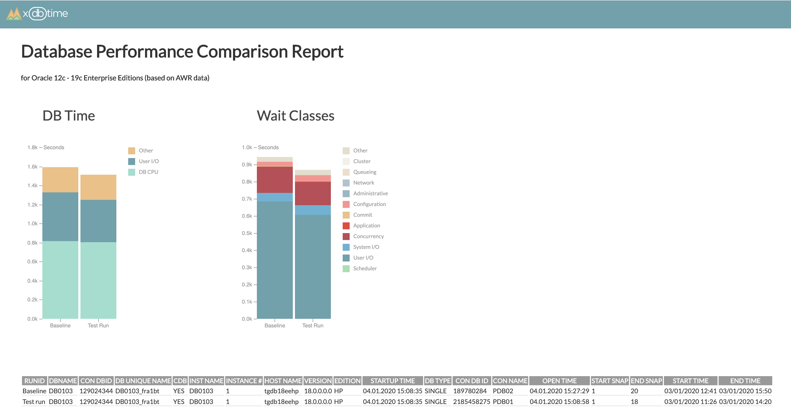

# xdbtime
Set of tools to measure and compare database performance.

Main goal is to identify performance issues on production system before they hit your business and on test environments before they hit production system. Xdbtime tools and reports can help to set up processes to compare database performance in  production databases periodically and in performance test environments before every release.



**xdbtime reports** are designed to compare database performance metrics visually in a simple way. Graphical representation minimises time required to analyse the report. It starts from the high level metrics like Database time and allows to go into details to find answers. You can classify your SQLs into groups which allows visually correlate changes in different SQL metrics. Conditional formatting attracts your attention to main drivers. It does not require DBA knowledge to review database performance report.

xdbtime is initially designed for Oracle databases. There are 2 configurations based on source of performance metrics:
- AWR data. If you are using Enterprised Edition with Diagnostic Pack license - AWR. (recommended).
- XDBSNAPSHOT data. If you do not have Diagnostic Pack license and want to analyze performance on Express / Standard Editions of Oracle Databases. It requires additional database schema and jobs and has its limitations.

xdbtime supports Oracle 12c - 19c XE, SE, EE, EE-HP, EE-EP. 
xdbtime reports were also tested on Oracle Cloud Databases (incl Autonomous database) and AWS Oracle RDS databases.

xdbtime for MySQL will be released soon.

## xdbtime - Period Comparison Report for Oracle

Period Comparison Report is designed to compare 2 time periods on same database. 
- For AWR configuration you can compare performance between Database Instances and Pluggable Databases.
- For XDBSNAPSHOT configuration you can compare time periods only on single instance / single PDB.


xdbtime report is a SQL script which spools data into output HTML file. 
HTML file is using HTML, CSS, JS and D3 library to build charts.
It requires parameters to define 2 time periods in database.

### AWR configuration (recommended)
Performance comparison report is based on AWR data (requires Enterprise Edition with Diagnostic Pack Oracle license).
cdb_hist_* and gv$ views are used as source for report. xdbtime report is alternative graphical way of representation of performance metrics compared to classical AWR report where all data is in text and table format.

User executing xdbtime report requires privileges to access AWR data (cdb_hist* and gv$ views). List of views:
- cdb_hist_snapshot
- cdb_hist_sys_time_model
- cdb_hist_sysstat
- cdb_hist_system_event
- cdb_hist_active_sess_history
- cdb_hist_sqlstat
- cdb_hist_sqltext
- v$database
- gv$instance
- gv$containers

There are two supporting SQL files which can help you to find DBIDs, instance IDs and snapshot IDs for time periods you want to compare.

#### Initial setup

1. Set up destination folder for report in `xdbtimeorclawr.sql` file: line #58
`define report_destination_folder = '/Users/'`

#### How to use
1. Connect to database with user having apropriate privileges.

If AWR is configured on PDB level, you can set container to CDB$ROOT and compare performance between PDBs. You can also generate report connecting directly to PDB.

2. Identify Database IDs, Instance IDs and snapshot IDs for time periods you want to compare.
Use `awrlistdbid.sql` to list available DBID and Instance in AWR.
Use `awrlistsnap.sql` to list available snapshots for particular DBID and Instance Number. This script will ask to provide DBID, Instance Number and 2 additional parameters:
- Last N hours  - to define for how many hours ago you are looking for snapshots (for instance for last 4 hours)
- Duration in hours - to define time window for which you are looking for snapshots (for instance 2 hours duration)
This script will show you all available snapshots based on your criteria (in our example it is between 2 and 4 hours ago).

3. Run xdbtime report `xdbtimeorclawr.sql` file. It will ask for DBID, Instance ID, Start and End Snapshot IDs for 2 time periods. SQL script will create HTML file in destination folder. 

#### Example

```
SQL> @awrlistdbid.sql

      DBID INSTANCE_NUMBER MIN_BEGIN_TIME      MAX_END_TIME       
---------- --------------- ------------------- -------------------
 189780284               1 03-01-2020 11:13:37 04-01-2020 21:50:17
 129024344               1 03-01-2020 11:13:37 04-01-2020 21:00:14
2185458275               1 03-01-2020 11:13:37 04-01-2020 21:50:17

SQL> @awrlistsnap.sql
Enter DBID: 2185458275
Enter Instance Number: 1
Enter last N hours - where you are looking for snapshots: 4
Enter duration in hours - where you are looking for snapshots: 2

      DBID INSTANCE_NUMBER    SNAP_ID BEGIN_INTERVAL_TIME
---------- --------------- ---------- -------------------
2185458275               1         76 04-01-2020 18:00:04
2185458275               1         77 04-01-2020 18:10:04
2185458275               1         78 04-01-2020 18:20:05
2185458275               1         79 04-01-2020 18:30:05
2185458275               1         80 04-01-2020 18:40:06
2185458275               1         81 04-01-2020 18:50:07
2185458275               1         82 04-01-2020 19:00:07
2185458275               1         83 04-01-2020 19:10:08
2185458275               1         84 04-01-2020 19:20:08
2185458275               1         85 04-01-2020 19:30:09
2185458275               1         86 04-01-2020 19:40:09
2185458275               1         87 04-01-2020 19:50:10

12 rows selected. 


SQL> @awrlistsnap.sql
Enter DBID: 189780284
Enter Instance Number: 1
Enter last N hours - where you are looking for snapshots: 2
Enter duration in hours - where you are looking for snapshots: 1

      DBID INSTANCE_NUMBER    SNAP_ID BEGIN_INTERVAL_TIME
---------- --------------- ---------- -------------------
 189780284               1         79 04-01-2020 20:00:11
 189780284               1         80 04-01-2020 20:10:11
 189780284               1         81 04-01-2020 20:20:12
 189780284               1         82 04-01-2020 20:30:12
 189780284               1         83 04-01-2020 20:40:13
 189780284               1         84 04-01-2020 20:50:14

6 rows selected. 

SQL> @xdbtimeorclawr.sql
Enter parameters for Baseline
Baseline: Enter DBID: 2185458275
Baseline: Enter Instance Number: 1
Baseline: Enter Start Snapshot ID: 81
Baseline: Enter End Snapshot ID: 86
Enter parameters for Test Run
Test Run: Enter DBID: 189780284
Test Run: Enter Instance Number: 1
Test Run: Enter Start Snapshot ID: 79
Test Run: Enter End Snapshot ID: 83
Baseline:
DBID: 2185458275
Instance number: 1
Range of samples: [81,86]
Range of time   : [04/01/2020 19:00,04/01/2020 19:50]
Test Run:
DBID: 189780284
Instance number: 1
Range of samples: [79,83]
Range of time   : [04/01/2020 20:10,04/01/2020 20:50]
Report is running ...
Report is written to /Users/xdbtime/Reports/XDBT_DB0103_2185458275_1_81to86vs189780284_1_79to83.html
```

### XDBSNAPSHOT configuration

Requires to create XDBSNAPSHOT database scheme with tables to store snapshots from v$ views and 2 jobs to capture Active Session History and snapshots periodically.

User executing report requires access to XDBSNAPSHOT tables and v$database and v$instance views.

There is one supporting SQL file which can help you to find snapshot IDs for time periods you want to compare.

#### Initial setup

1. Create XDBSNAPSHOT schema using `create_xdbsnapshot_scheme.sql` file. Execute it by SYS user (or by another user with appropriate privileges). 
It will create set of tables to store snapshots and 2 jobs to create snapshopts of v$ views periodically. You can change password, tablespace and job execution intervals.

Check if snapshots are created using following SQL script:
```
select * from XDBSNAPSHOT.TBL_SNAPSHOT order by 1 desc;
```

Example of `create_xdbsnapshot_scheme.sql` execution:
```
SQL> @create_xdbsnapshot_scheme.sql

User XDBSNAPSHOT created.

Grant succeeded.

Grant succeeded.

Grant succeeded.

Table XDBSNAPSHOT.TBL_ASH created.

Table XDBSNAPSHOT.TBL_SYS_TIME_MODEL created.

Table XDBSNAPSHOT.TBL_SYSSTAT created.

Table XDBSNAPSHOT.TBL_SYSTEM_EVENT created.

Table XDBSNAPSHOT.TBL_SQLSTATS created.

Index XDBSNAPSHOT.IDX_SQLSTATS_01 created.

Table XDBSNAPSHOT.TBL_OSSTAT created.

Table XDBSNAPSHOT.TBL_SNAPSHOT created.

Index XDBSNAPSHOT.IDX_SNAPSHOT_01 created.

Table XDBSNAPSHOT.TBL_SQL_TEXT created.

Index XDBSNAPSHOT.IDX_SQL_TEXT created.

Table XDBSNAPSHOT.TBL_SQL_PLAN created.

Index XDBSNAPSHOT.IDX_SQL_PLAN created.

Sequence XDBSNAPSHOT.SEQ_ASH created.

Sequence XDBSNAPSHOT.SEQ_AWR created.

Procedure PR_ASH_CAPTURE compiled

Procedure PR_AWR_CAPTURE compiled

PL/SQL procedure successfully completed.

PL/SQL procedure successfully completed.

SQL> select * from XDBSNAPSHOT.TBL_SNAPSHOT order by 1 desc;

 SAMPLE_ID SAMPLE_T INSTANCE_NUMBER INSTANCE_NAME    STARTUP_
---------- -------- --------------- ---------------- --------
         1 04-01-20               1 ORCL             01-01-20
```

2. Set up destination folder for report in `xdbtimeorclxdbs.sql` file: line #58
`define report_destination_folder = '/Users/'`


#### How to use
1. Connect to database with user having apropriate privileges.

2. Identify snapshots for time periods you want to compare.
Use `xdbslistsnap.sql` to list available snapshots. This script will ask to provide 2 parameters:
- Last N hours  - to define for how many hours ago you are looking for snapshots (for instance for last 4 hours)
- Duration in hours - to define time window for which you are looking for snapshots (for instance 2 hours duration)
This script will show you all available snapshots based on your criteria (in our example it is between 2 and 4 hours ago).

3. Run xdbtime report `xdbtimeorclxdbs.sql` file. It will ask for Start and End Snapshot IDs for 2 time periods. SQL script will create HTML file in destination folder. 

#### Example

```
SQL> @xdbslistsnap.sql
Enter last N hours - where you are looking for snapshots: 3
Enter duration in hours - where you are looking for snapshots: 2

 SAMPLE_ID SAMPLE_TIME        
---------- -------------------
         9 04-01-2020 19:19:07
        10 04-01-2020 19:34:07
        11 04-01-2020 19:49:07
        12 04-01-2020 20:04:07
        13 04-01-2020 20:19:07
        14 04-01-2020 20:34:07
        15 04-01-2020 20:49:07
        16 04-01-2020 21:04:07

8 rows selected. 

SQL> @xdbtimeorclxdbs.sql
Enter parameters for Baseline
Baseline: Enter Start Snapshot ID: 9
Baseline: Enter End Snapshot ID: 12
Enter parameters for Test Run
Test Run: Enter Start Snapshot ID: 13
Test Run: Enter End Snapshot ID: 16
Baseline:
Range of samples: [9,12]
Range of time   : [04/01/2020 19:19,04/01/2020 20:04]
Test Run:
Range of samples: [13,16]
Range of time   : [04/01/2020 20:19,04/01/2020 21:04]
Report is running ...
Report is written to /Users/xdbtime/Reports/XDBT_1550854466_ORCL_9to12vs13to16.html
```
