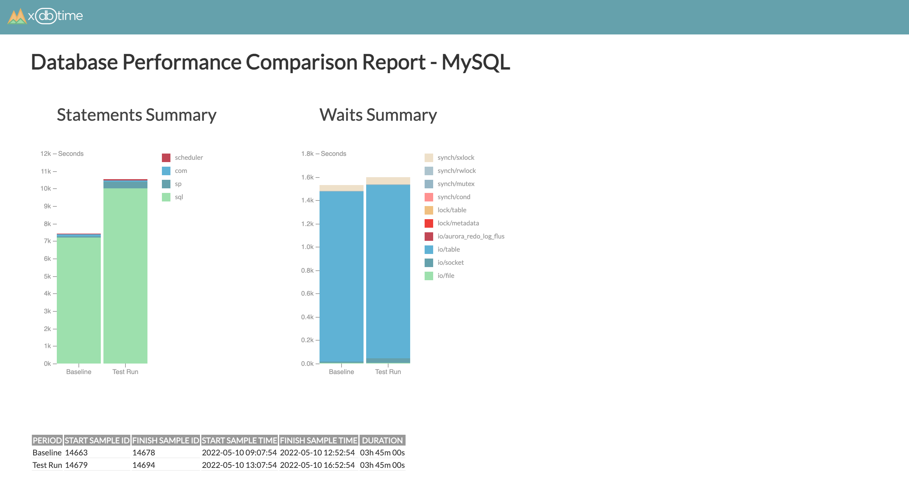

# xdbtime for MySQL

Set of tools to measure and compare database performance on MySQL databases.

The main goal is to identify performance issues in production systems before they hit your customers and in test environments before they are released to production systems. Xdbtime tools and reports can help to set up processes to compare database performance in production databases periodically and in performance test environments before every release.



xdbtime for MySQL offers:
- Performance status report for MySQL databases (based on MySQL Performance Schema)

xdbtime(pro) additionally offers two products (not covered by open-source license):
- Period comparison report - to compare two periods of time on a single MySQL database instance
- Test comparison report - to compare two test runs. Performance metrics from these test runs were collected and stored in a separate database using xdbtime.

xdbtime for MySQL supports MySQL 5.7, MySQL 8.0, and Amazon Aurora MySQL.

## xdbtime for MySQL - Performance Status Report

Performance Status Report is designed to give performance overview of MySQL database based on data available in Performance Schema.

xdbtime reports are user-defined MySQL Shell reports written in Python language that create a report in HTML format.
Reports are using HTML, CSS, JS, and D3 libraries to build charts.

### Initial setup

1. Make sure PERFORMANCE SCHEMA (https://dev.mysql.com/doc/refman/8.0/en/performance-schema-quick-start.html) is enabled in MySQL Instance.

Use the following commands to check it:
```
SHOW VARIABLES LIKE 'performance_schema';
```

2. Install MySQL Shell https://dev.mysql.com/doc/mysql-shell/8.0/en/;

3. Checkout xdbtime project
```
git checkout https://github.com/xdbtime/xdbtime.git
```

4. Create `init.d` folder for MySQL Shell report if it does not exist:

```
mkdir -p ~/.mysqlsh/init.d
```

3. Go to `xdbtime/mysql` folder. This is the working folder to generate MySQL reports:

```
cd xdbtime/mysql
```

4. Copy the `xdbperformance-status.py` report into the MySQL Shell Reports folder:

```
cp init.d/xdbperformance-status.py ~/.mysqlsh/init.d
```

5. Start MySQL Shell in Python mode and check available reports

```
mysqlsh --py
```

6. And check available reports

```
\show
```

Make sure that the following report is available: `performance`.

### How to use

1. Make sure you are in  `xdbtime/mysql` folder. Reports are generated from this folder and stored in the reports folder

2. Use MySQL Shell to connect to a target MySQL instance with user that has read permissions to the Performance Schema.

```
mysqlsh user@exampledb --py
```

3. Create performance status report `\show performance`. The report will be written in the `reports` folder.

```
 MySQL  127.0.0.1:3306 ssl  Py > \show performance

XDBTIME reports for MySQL
Copyright (c) 2016, 2022, XDBTIME Taras Guliak
Version: 2022.11

Creating MySQL Performance Summary Report ...
Report is written to: ./reports/mysql-xdbperf-status-ip-127-0-0-1-2022-05-18-20-21-55.html

Report should return a dictionary.
```

You can open the report directly from the command line: just press the Command button and click on the report link.

