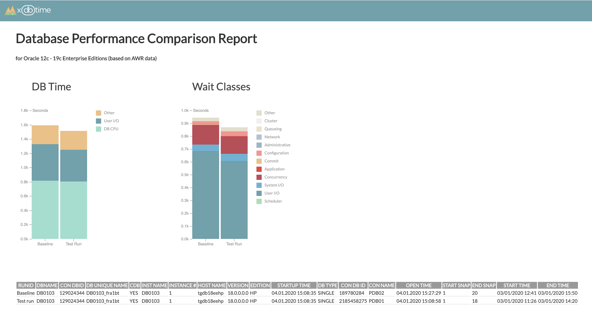

# xdbtime for Oracle
Set of tools to measure and compare database performance on Oracle databases.

The main goal is to identify performance issues in production systems before they hit your customers and in test environments before they are released to production systems. Xdbtime tools and reports can help to set up processes to compare database performance in production databases periodically and in performance test environments before every release.



xdbtime for Oracle offers:
- Period comparison report - to compare two periods of time on a single Oracle database instance

xdbtime(pro) additionally offers the following product (not covered by open-source license):
- Test comparison report - to compare two test runs. Performance metrics from these test runs were collected and stored in a separate database using xdbtime.

xdbtime for Oracle supports 12c - 19c.

## xdbtime for Oracle - Period Comparison Report

Period Comparison Report is designed to compare 2 periods of time on the same database instance.

xdbtime reports are SQL scripts that create a report in HTML format (using spool).
Reports are using HTML, CSS, JS, and D3 libraries to build charts.

There are 2 sources of performance metrics:
- AWR data. If you are using Enterprise Edition with Diagnostic Pack license - AWR. (recommended).
- `XDBMONITORING` data. If you do not have Diagnostic Pack license and want to analyze performance on Express / Standard Editions of Oracle Databases. It requires additional database schema and jobs and has its limitations.

### Source: AWR data (recommended)

The performance comparison report is based on AWR data (requires Enterprise Edition with Diagnostic Pack Oracle license).
cdb_hist_* and gv$ views are used as sources for the report.

User executing xdbtime report requires privileges to access AWR data (cdb_hist* and gv$ views). List of views:
- cdb_hist_snapshot
- cdb_hist_sys_time_model
- cdb_hist_sysstat
- cdb_hist_system_event
- cdb_hist_active_sess_history
- cdb_hist_sqlstat
- cdb_hist_sqltext
- v$database
- gv$instance
- gv$containers

There are two supporting SQL files that can help you to find DBIDs, instance IDs, and snapshot IDs for time periods you want to compare.

#### Initial setup

Checkout xdbtime project (if it is not done yet):
```
git checkout https://github.com/xdbtime/xdbtime.git
```

1. Go to the `oracle` folder:

```
$ cd xdbtime/oracle
```

#### How to use

1. Connect to a database with `sqlcl` or `sqlplus` by user having appropriate privileges (cdb_hist_* and gv$ views).

If AWR is configured on the PDB level, you can set container to CDB$ROOT and compare performance between PDBs. You can also generate report connecting directly to PDB.

2. Identify Database IDs, Instance IDs, and snapshot IDs for time periods you want to compare.

Use `xdbawrlistdbid.sql` to list available DBIDs and Instances in AWR.

Use `xdbawrlistsnap.sql` to list available snapshots for particular DBID and Instance Number. 

This script will ask to provide DBID, Instance Number, and 2 additional parameters:
- Last N hours  - to define how many hours ago you are looking for snapshots (for instance for last 4 hours)
- Duration in hours - to define time window for which you are looking for snapshots (for instance 2 hours duration)
This script will show you all available snapshots based on your criteria (in our example it is between 2 and 4 hours ago).

3. Run xdbtime report `xdbawrcompare.sql` file. It will ask for DBID, Instance ID, Start and End Snapshot IDs for 2 time periods. SQL script will create HTML file in destination folder. 

#### Example

```
SQL> @xdbawrlistdbid.sql

      DBID INSTANCE_NUMBER MIN_BEGIN_TIME      MAX_END_TIME       
---------- --------------- ------------------- -------------------
 189780284               1 03-01-2020 11:13:37 04-01-2020 21:50:17
 129024344               1 03-01-2020 11:13:37 04-01-2020 21:00:14
2185458275               1 03-01-2020 11:13:37 04-01-2020 21:50:17

SQL> @xdbawrlistsnap.sql
Enter DBID: 2185458275
Enter Instance Number: 1
Enter last N hours - where you are looking for snapshots: 4
Enter duration in hours - where you are looking for snapshots: 2

      DBID INSTANCE_NUMBER    SNAP_ID BEGIN_INTERVAL_TIME
---------- --------------- ---------- -------------------
2185458275               1         76 04-01-2020 18:00:04
2185458275               1         77 04-01-2020 18:10:04
2185458275               1         78 04-01-2020 18:20:05
2185458275               1         79 04-01-2020 18:30:05
2185458275               1         80 04-01-2020 18:40:06
2185458275               1         81 04-01-2020 18:50:07
2185458275               1         82 04-01-2020 19:00:07
2185458275               1         83 04-01-2020 19:10:08
2185458275               1         84 04-01-2020 19:20:08
2185458275               1         85 04-01-2020 19:30:09
2185458275               1         86 04-01-2020 19:40:09
2185458275               1         87 04-01-2020 19:50:10

12 rows selected. 


SQL> @xdbawrlistsnap.sql
Enter DBID: 189780284
Enter Instance Number: 1
Enter last N hours - where you are looking for snapshots: 2
Enter duration in hours - where you are looking for snapshots: 1

      DBID INSTANCE_NUMBER    SNAP_ID BEGIN_INTERVAL_TIME
---------- --------------- ---------- -------------------
 189780284               1         79 04-01-2020 20:00:11
 189780284               1         80 04-01-2020 20:10:11
 189780284               1         81 04-01-2020 20:20:12
 189780284               1         82 04-01-2020 20:30:12
 189780284               1         83 04-01-2020 20:40:13
 189780284               1         84 04-01-2020 20:50:14

6 rows selected. 

SQL> @xdbawrcompare.sql
Enter parameters for Baseline
Baseline: Enter DBID: 2185458275
Baseline: Enter Instance Number: 1
Baseline: Enter Start Snapshot ID: 81
Baseline: Enter End Snapshot ID: 86
Enter parameters for Test Run
Test Run: Enter DBID: 189780284
Test Run: Enter Instance Number: 1
Test Run: Enter Start Snapshot ID: 79
Test Run: Enter End Snapshot ID: 83
Baseline:
DBID: 2185458275
Instance number: 1
Range of samples: [81,86]
Range of time   : [04/01/2020 19:00,04/01/2020 19:50]
Test Run:
DBID: 189780284
Instance number: 1
Range of samples: [79,83]
Range of time   : [04/01/2020 20:10,04/01/2020 20:50]
Report is running ...
Report is written to ./reports/xdbawr_compare_DB0103_2185458275_1_81to86vs189780284_1_79to83.html
```

### Source: XDBMONITORING schema

The performance comparison report is based on data from the `XDBMONITORING` schema that must be created in advance.

`XDBMONITORING` jobs collect active sessions and snapshots from v$ views periodically.

User executing report requires access to the `XDBMONITORING` tables and v$database and v$instance views. `XDBMONITORING` user can be used to build reports.

There is `xdbmolistsnap.sql` SQL file that can help you to find snapshot IDs for time periods you want to compare.

#### Initial setup

Checkout xdbtime project (if it is not done yet):
```
git checkout https://github.com/xdbtime/xdbtime.git
```

1. Go to the `oracle` folder:

```
$ cd xdbtime/oracle/schemas/xdbmonitoring/create
```
2. Review `xdbmonitoring.sql` file. Set password for the user. 

You can provide details about the database in `tbl_db_info` (line 34).
These details (db_name, app_name, app_version, data_set, description) can be exported together with performance metrics into XBDWAREHOUSE database and compared.

3. Create `XDBMONITORING` schema using `xdbmonitoring.sql` file. Execute it by SYS user (or by another user with appropriate privileges). 

It will create set of tables to store snapshots and 2 jobs to create snapshopts of v$ views periodically.

Check if snapshots are created using following SQL script:
```
select * from XDBMONITORING.TBL_SNAPSHOT order by 1 desc;
```

Example of `xdbmonitoring.sql` execution:
```
SQL> @xdbmonitoring.sql

User XDBMONITORING created.

Grant succeeded.

Grant succeeded.

Grant succeeded.

Table XDBMONITORING.TBL_DB_INFO created.

1 row inserted.

Table XDBMONITORING.TBL_ASH created.

Table XDBMONITORING.TBL_SYS_TIME_MODEL created.

Table XDBMONITORING.TBL_SYSSTAT created.

Table XDBMONITORING.TBL_SYSTEM_EVENT created.

Table XDBMONITORING.TBL_SQL created.

Table XDBMONITORING.TBL_SQLSTATS created.

Index XDBMONITORING.IDX_SQLSTATS_01 created.

Table XDBMONITORING.TBL_OSSTAT created.

Table XDBMONITORING.TBL_SNAPSHOT created.

Index XDBMONITORING.IDX_SNAPSHOT_01 created.

Table XDBMONITORING.TBL_SQL_TEXT created.

Index XDBMONITORING.IDX_SQL_TEXT created.

Table XDBMONITORING.TBL_SQL_PLAN created.

Index XDBMONITORING.IDX_SQL_PLAN created.

Table XDBMONITORING.TBL_METRIC created.

Sequence XDBMONITORING.SEQ_ASH created.

Sequence XDBMONITORING.SEQ_AWR created.

Procedure PR_ASH_CAPTURE compiled

Procedure PR_SNAP_CAPTURE compiled

PL/SQL procedure successfully completed.

PL/SQL procedure successfully completed.

SQL> select * from XDBMONITORING.TBL_SNAPSHOT order by 1 desc;

   SAMPLE_ID    SAMPLE_TIME    INSTANCE_NUMBER    INSTANCE_NAME    STARTUP_TIME
____________ ______________ __________________ ________________ _______________
           1 05-MAY-22                       1 ORCL             05-MAY-22
```

#### How to use

1. Go to the `oracle` folder:

```
$ cd ../../..
```

2. Connect to a database with `sqlcl` or `sqlplus` by the `XDBMONITORING` user (or any other user that has permissions to select `XDBMONITORING` schema and v$ views).

3. Identify snapshots for time periods you want to compare.

Use `xdbmolistsnap.sql` to list available snapshots. This script will ask to provide 2 parameters:
- Last N hours  - to define how many hours ago you are looking for snapshots (for instance for last 4 hours)
- Duration in hours - to define time window for which you are looking for snapshots (for instance 2 hours duration)
This script will show you all available snapshots based on your criteria (in our example it is between 2 and 4 hours ago).

4. Run xdbtime report `xdbmocompare.sql` file. It will ask for Start and End Snapshot IDs for 2 time periods. Link to the report will be shown in output. 

#### Example

```
SQL> @xdbmolistsnap.sql
Enter last N hours - where you are looking for snapshots: 3
Enter duration in hours - where you are looking for snapshots: 2

 SAMPLE_ID SAMPLE_TIME        
---------- -------------------
         9 04-01-2020 19:19:07
        10 04-01-2020 19:34:07
        11 04-01-2020 19:49:07
        12 04-01-2020 20:04:07
        13 04-01-2020 20:19:07
        14 04-01-2020 20:34:07
        15 04-01-2020 20:49:07
        16 04-01-2020 21:04:07

8 rows selected. 

SQL> @xdbmocompare.sql
Enter parameters for Baseline
Baseline: Enter Start Snapshot ID: 9
Baseline: Enter End Snapshot ID: 12
Enter parameters for Test Run
Test Run: Enter Start Snapshot ID: 13
Test Run: Enter End Snapshot ID: 16
Baseline:
Range of samples: [9,12]
Range of time   : [04/01/2020 19:19,04/01/2020 20:04]
Test Run:
Range of samples: [13,16]
Range of time   : [04/01/2020 20:19,04/01/2020 21:04]
Report is running ...
Report is written to ./reports/xdbmo_compare_1550854466_ORCL_9to12vs13to16.html
```
